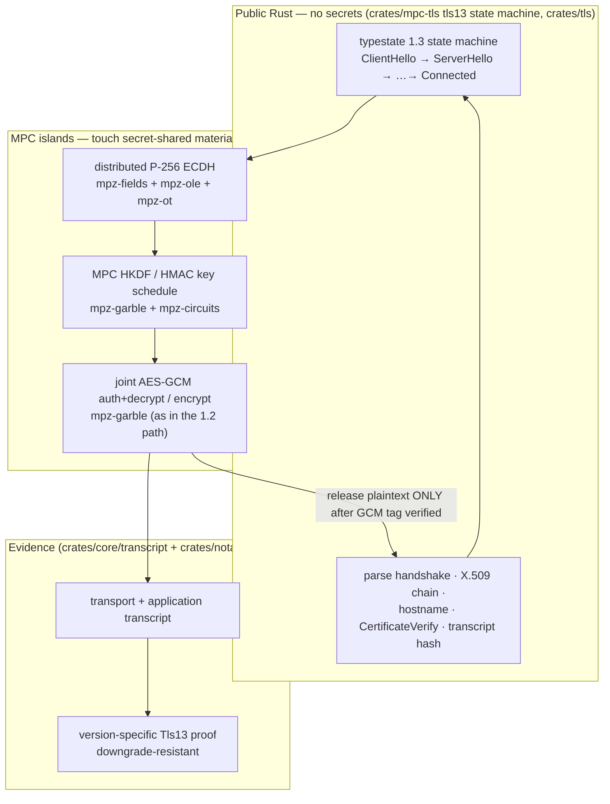

# TLS 1.3 MPC-TLS backend — assessment & research plan

**Status:** TLS 1.3 joint AEAD and authenticated release implemented; fixture and nginx/Apache/Caddy/OpenSSL interop green; security hardening and audit remain · **Audience:** MPC-TLS engineer picking this up
**Companion:** [`tls13-mpc-tls-backend.proposal.md`](./tls13-mpc-tls-backend.proposal.md) — the original design brief.

---

## 0. Provenance & what this document is

The companion proposal is an **AI-generated design brief** (note its `[oai_citation:…]` markers). It is a
genuinely good starting point, but its crate/primitive names are *aspirational* and do not match this
repository. **This document is an engineering assessment of that brief plus a plan reconciled with the
actual `advatar/tlsn` + `mpz` code**, so the work can start against real modules rather than a sketch.

### Baseline already shipped (do not regress)

- **Real TLS 1.2 notarization works today.** The prover pins the *offered* TLS version to 1.2
  (`crates/tlsn/src/prover.rs`, `with_protocol_versions(&[&tls_client::version::TLS12])`), which makes
  dual-stack servers negotiate 1.2 so the existing MPC-TLS engine can split keys. A deployed notary
  gateway (`crates/browser-demo`) signs a portable `SignedArtifact` (`crates/notary-artifact`).
- **Hybrid post-quantum *attestation*** (ES256 + ML-DSA-65 over the same payload) is implemented in
  `crates/notary-artifact` behind the `pq-sign` feature. **This is orthogonal to the work below** — it
  is a property of the notary's *signature*, not of the TLS transport. TLS 1.3 work neither needs it nor
  changes it.

The 1.2 path is the fallback the 1.3 backend must not break. The hard-coded 1.2 pin should eventually
become a per-`ProverConfig` option once 1.3 is real.

---

## 1. Verdict on the brief

**Agree with the thesis and the core architecture.** In particular these calls are correct and are the
ones I would make:

- **A separate 1.3 state machine, not an incremental patch of the 1.2 path.** 1.3's encrypted handshake,
  HKDF key schedule, and record protection differ enough that the current half-patched attempt is exactly
  the trap to avoid (see §2).
- **"MPC only for operations touching secret-shared traffic secrets; authenticated *release* of handshake
  plaintext for public parsing / certificate validation."** This is the crux and it is right: 1.3
  handshake messages (`EncryptedExtensions`, `Certificate`, `CertificateVerify`, `Finished`) carry no
  user-private data, so MPC is needed only for the AEAD auth + key schedule, never the whole parser.
- **The client ECDHE scalar must be jointly generated / kept from the prover.** Subtle and important: if
  the prover knows `x` and the server share `Y` is public, the prover alone computes `Z = x·Y` and can
  forge "server" responses, breaking the entire provenance guarantee.
- **Narrow v1 profile** (1-RTT, server-auth only, no PSK/0-RTT/resumption, reject `KeyUpdate`/HRR) and a
  **version-specific, downgrade-resistant proof object.** Both sound; the downgrade point mirrors the
  downgrade-closed discipline already used in the hybrid-PQ attestation.

**Caveats / where the brief is optimistic:**

1. **Effort is understated.** This is a multi-month, research-grade effort ending in a **cryptographic
   audit** — not an incremental feature.
2. **The two-party P-256 ECDH is the asymmetric core**, and the brief's "start with a generic Boolean circuit"
   reference path is likely *impractically* slow (a 255-bit Montgomery ladder as a garbled Boolean circuit
   is enormous, and worse in browser WASM). Prefer curve/field arithmetic over `mpz-fields` + `mpz-ole`.
3. **The proposed `mpz-hkdf` / `mpz-hmac` / `mpz-x25519` / `mpz-aead` crates do not exist.** They must be
   *built on* the existing `mpz-*` toolbox (see §3). Treat the brief's crate tree as illustration only.
4. **Classical KEM only.** The implemented TLS 1.3 key exchange is P-256; it does not yet provide
   threshold security for PQ TLS transport. That is a separate workstream from hybrid-PQ *attestation*.

---

## 2. Current TLS 1.3 state in this fork

> **Corrected 2026-08-05.** An earlier revision of this section claimed the 1.3 path was
> non-functional because "the follower never receives the server handshake records (the leader
> captures them but does not relay)", causing `validate_tls13_finished` to always error *"server
> finished was not observed in the transcript."* **That diagnosis was wrong on every point**, and the
> conclusion drawn from it — that a fresh backend was needed — did not follow. What was actually
> verified:
>
> - The relay exists. `crates/mpc-tls/src/leader.rs` sends `Message::Tls13RecvRecord` and
>   `crates/mpc-tls/src/follower.rs` receives it into `tls13_recv_records`.
> - `validate_tls13_finished` was never reached. Every `tls13_*` test failed on its **first**
>   assertion — `left: V1_2, right: V1_3` — because `crates/tlsn/src/prover.rs` hard-pinned the
>   offered version to 1.2, so no session ever negotiated 1.3.
> - Once 1.3 can be offered, the path works. `validate_tls13_finished` is reached and passes; this was
>   confirmed by temporarily making the `TlsVersion::V1_3` arm return an error and observing both
>   prover and verifier fail, which proves the code executes rather than being skipped.
>
> Lesson for anyone extending this document: confirming that a symbol *exists* in two files is not
> the same as confirming the logic between them is missing. Run the tests.

> ## ✅ The key-disclosure hole is closed and joint TLS 1.3 record protection is operational
>
> **Resolved.** The application traffic keys are no longer decoded. `set_handshake_hash` keeps them as
> VM references, exactly as the TLS 1.2 path always has, and the plaintext shadow copy
> (`clear_application`) and the local `Aes128Gcm` that consumed it are gone.
>
> Application keys and IVs remain VM references. Bounded per-record AES/J0 circuits are allocated in
> the initial MPC graph, directional epochs own their sequence numbers, and GHASH uses only the
> negotiated protocol's key domain. Incoming plaintext is two-sided masked; the verifier's mask is
> released in an HMAC capsule keyed by its tag share, so an invalid public tag cannot open it.
>
> The five-case fixture matrix and nginx RSA/ECDSA, Apache RSA, Caddy RSA, and raw OpenSSL `s_server`
> interoperability cases pass end to end through transcript proof verification. Supported callers
> use `Tls13Only` or `Tls12AndTls13`; the deprecated `Tls13Unsafe` spellings remain only for API
> compatibility and no longer emit the obsolete key-disclosure warning.
>
> ### The original defect, for the record
>
> **The prover learns the TLS 1.3 application traffic keys in the clear.** In
> `crates/mpc-tls/src/tls13.rs`, `set_handshake_hash` calls `vm.decode(..)` on all four application
> keys (`client_write_key`, `client_iv`, `server_write_key`, `server_iv`) and executes, storing the
> results in a field named `clear_application`. `decrypt_tls13_record` then uses a **plain
> `Aes128Gcm`** with those keys. A `decode` reveals a value to *both* parties.
>
> This voids provenance. A prover holding `server_write_key` can encrypt arbitrary bytes under the
> server's key and present them as the server's response, which is the exact attack the protocol
> exists to prevent. It directly contradicts the invariant stated in section 3 of this document:
> *neither prover nor verifier ever holds the complete server application traffic key*.
>
> The contrast with the working path makes the gap unambiguous:
>
> | | TLS 1.2 | TLS 1.3 |
> |---|---|---|
> | Application keys | stay VM references (`Array<U8, 16>`), passed to `record_layer.set_keys` | `vm.decode(..)` → plaintext `[u8; 16]` |
> | AEAD | joint, in MPC | local `Aes128Gcm` in the leader |
>
> And `crates/components/hmac-sha256/src/tls13.rs` uses `mask_private` / `mask_blind` exactly where
> only the leader should learn a value (the handshake secrets), so the distinction between masking and
> decoding was understood — the plain decode of the *application* keys is the gap, not an idiom.
>
> **The original passing tests could not detect this.** They verified plumbing against honest
> servers, not malicious-prover behavior. The current implementation adds a negative
> authenticated-release test: changing the expected tag share prevents the verifier mask capsule
> from opening. A green interop matrix alone is still not a substitute for external review.
>
> ### Closing it looks tractable — likely rewiring, not new cryptography
>
> A first estimate called this "substantial architectural work". That was too pessimistic. The
> existing TLS 1.2 joint AEAD appears reusable almost as-is:
>
> - **The nonce maps exactly onto the existing interface.** A 1.3 nonce is `iv XOR seq`, with the
>   64-bit sequence number XORed into the **last 8 bytes**. So the leading 4 bytes are constant for
>   the connection and only the trailing 8 vary — which is precisely `MpcAesGcm`'s existing
>   `set_iv(Array<U8, 4>)` plus `Nonce = Array<U8, 8>` split. For 1.3 the "explicit nonce" is a
>   computed value rather than one read off the wire. No new circuits.
> - **The AAD is already parameterized.** `record_layer.rs` passes `aad: Vec<u8>`, built by
>   `make_tls12_aad`; `make_tls13_aad` already exists in `crates/mpc-tls/src/tls13.rs`. Swap the
>   constructor.
> - **Inner plaintext** (content type plus zero padding) is framing rather than cryptography, and the
>   reference oracle already implements and tests it.
>
> One feasibility question remains open, and it needs the `mpz` sources rather than this checkout:
> whether a VM `Array<U8, 12>` can be split into `[0..4]` and `[4..12]` sub-references. If it cannot,
> the alternative is to have `Tls13KeySched` emit the IV as two arrays directly — it derives them via
> HKDF inside the VM, so producing 4+8 halves is a local change.
>
> Correctness is checkable against `crates/tls/tls13-reference`, which exists for exactly this. A
> **malicious-prover test** should land alongside, so this class of gap is detectable rather than
> invisible.

The 1.3 path is **substantially working as plumbing** — see the warning above for why that is not the
same as support. As of 2026-08-05:

- **Passing** — 6 end-to-end MPC-TLS 1.3 notarizations against the in-repo rustls fixture
  (`crates/tlsn/tests/tls13_matrix.rs`, 5 cases across RSA/ECDSA chains and none/optional/required
  client auth, plus `test_tls13`). Each asserts the negotiated version is `V1_3` and runs the full
  commit → connect → prove → verify flow.
- **Passing against real servers** — nginx 1.27 (RSA and ECDSA), Apache httpd 2.4 and Caddy 2.10,
  via `crates/tlsn/tests/interop/docker-compose.yml`. Four of the five interop cases pass.
- **Fixed** — servers in middlebox-compatibility mode send a plaintext `change_cipher_spec` after
  `ServerHello`. RFC 8446 section 5 requires a client to ignore it during the handshake, but
  `push_incoming` fed every 1.3 record to `decrypt_record`, so opening a one-byte plaintext record
  killed the connection right after `ServerHello`. This affected every Go `crypto/tls` server, Caddy
  included.
- **Fixed** — the decrypt epoch was applied too late. A 1.3 record's epoch is decided by handshake
  progress: everything through the server's `Finished` uses handshake keys, everything after uses
  application keys. The client signals the switch via `set_decrypt`, but only once it has *processed*
  the `Finished`, whereas `push_incoming` decrypted **on arrival**. Any record sharing a read with
  the `Finished` was therefore opened with a stale epoch. A server that coalesces its
  `NewSessionTicket` into that batch — Go's `crypto/tls` does, so Caddy does — had the ticket opened
  under handshake keys and failed the AEAD tag with `tls13 record authentication failed`.
  Records are now queued raw and decrypted in `next_incoming`, under whichever epoch is current then.
  This is worth understanding before touching the record path: decrypt-on-arrival is *structurally*
  wrong for 1.3, and it happened to work only against servers that leave a gap after `Finished`.
- **Open, OpenSSL `s_server`** — the only remaining interop failure, and the least representative
  (a test utility, not a production server; nginx, Apache and Caddy cover the real web). The
  handshake completes and the full response arrives — `EncryptedExtensions`, `Certificate`,
  `CertificateVerify`, `Finished`, **two** post-handshake `NewSessionTicket` messages, the
  application data, then `close_notify` — and the session then hangs rather than completing. The
  epoch fix above did **not** resolve it, so it is a distinct bug, not a decryption failure: every
  record decrypts and the stall is after all data has arrived. That is eight records against a
  fixture configured with `max_recv_records_online(8)`, so record accounting around the two
  post-handshake tickets is the first thing to check. A hang is the worst available failure mode and
  should become a clean rejection whatever the cause.
- **Caution on the interop suite** — the five `tls13_interop` cases `return` early unless
  `TLSN_RUN_DOCKER_INTEROP=1` is set, and so pass in 0.00s having tested nothing. Treat a green run
  without that variable as no evidence at all.

What remains is therefore incremental hardening of the existing path, not a rewrite.

---

## 3. Reconciliation — where each piece lands in THIS repo

| Brief's proposal | Reality in `advatar/tlsn` + `mpz` |
|---|---|
| new `tlsn-tls-core/tls13/` engine | extend **`crates/mpc-tls`** (`leader.rs`, `follower.rs`, `record_layer/`, a **new** `tls13/` state machine replacing today's `tls13.rs`) + the TLS types in **`crates/tls/{core,client}`** |
| `mpz-hkdf`, `mpz-hmac` | build `MpcHkdf`/`MpcHmac` on **`mpz-garble(-core)`** + **`mpz-circuits`** (SHA-256 circuit) + **`mpz-share-conversion`**; transcript hashes are public once messages are authenticated, so hashing is mostly *not* in MPC |
| `mpz-aead` (AES-GCM / ChaCha20-Poly1305) | the 1.2 path already does joint AES-GCM in `crates/mpc-tls`; reuse/generalize it via **`mpz-garble`** + **`mpz-circuits`** rather than a new crate |
| `mpz-x25519` distributed ECDH | **`mpz-fields`** + **`mpz-ole`** (oblivious linear evaluation) + **`mpz-ot`** — a field/OLE-based two-party scalar-mult, **not** a Boolean garbled ladder |
| `Tls13SessionConfig` / `config_hash` binding | new config type in `crates/mpc-tls` + bind into the proof; verifier nonce already has an analogue in the session flow |
| `Tls13SessionProof` version-specific proof | extend **`crates/core/src/transcript/`** (`proof.rs`, `commit.rs`) and the portable **`crates/notary-artifact`** `SignedArtifact` — reuse its existing versioning + downgrade-closed discipline; **do not** overload the 1.2 proof with optional 1.3 fields |
| verifier server-auth (X.509 + `CertificateVerify` + `Finished`) | **`crates/verifier`** / `crates/tlsn` verifier side + `crates/tls/core` cert validation — Model A (public validation after authenticated release) is the MVP |

### Proposed architecture (the one call that matters)

The invariant throughout: **neither prover nor verifier ever holds the complete server application traffic
key** (`server_application_traffic_secret` stays secret-shared). MPC is used narrowly for ECDHE, the
HKDF/HMAC over secret material, and AEAD; everything else is ordinary Rust with strict transcript binding.

---

## 4. Milestones (reconciled with the codebase)

Adapted from the brief's M1–M6, pointed at real modules.

1. **M1 — non-MPC 1.3 reference engine (the oracle).** A deterministic single-party 1.3 client for the
   narrow profile (P-256, `TLS_AES_128_GCM_SHA256`, HTTP/1.1) with RFC 8446 test-vector coverage and
   key-schedule / transcript tracing. Lives alongside `crates/tls/client`. Everything MPC is later tested
   against this.
2. **M2 — MPC key schedule + record layer.** `MpcHkdf`, `MpcHmac`, AEAD, sequence-derived nonces,
   authenticated-release semantics — on `mpz-garble`/`mpz-circuits`/`mpz-share-conversion`, validated on
   RFC vectors with fixed secrets before ECDHE.
3. **M3 — distributed P-256 ECDH (implemented asymmetric core).** Shared client-scalar generation + shared-secret compute on
   `mpz-fields` + `mpz-ole`. Tests: neither party alone derives `Z`; valid public key; low-order/invalid
   point rejection; matches a reference P-256 ECDH; aborts leak no reusable scalar share.
4. **M4 — full handshake** in `crates/mpc-tls` (new `tls13/`): ClientHello/ServerHello, encrypted server
   flight with authenticated release, X.509 + `CertificateVerify` + `Finished`, transition to app keys.
   Retire `crates/mpc-tls/src/tls13.rs`; make `crates/tlsn/tests/tls13_{matrix,interop}.rs` pass for real.
5. **M5 — proof integration.** Version-specific 1.3 proof in `crates/core/transcript` +
   `crates/notary-artifact`; transcript commitments; selective disclosure; verifier signature; WASM
   (`crates/wasm`) + iOS (`crates/ios`) bindings. Keep the 1.2 proof path intact.
6. **M6 — production hardening + audit.** Malformed-handshake fuzzing, cross-implementation interop
   (nginx/Apache/rustls/BoringSSL/Cloudflare/AWS), malicious-prover and malicious-verifier tests,
   zeroization, resource limits, and an external cryptographic review.

---

## 5. Security properties to formalize

The fork already carries a formal-methods discipline (Lean/Tamarin) used for the issuer and for the
hybrid-PQ attestation. Specify these as protocol claims **before** coding (per the brief's list):
server provenance · response unforgeability · request binding · verifier privacy · prover privacy against
aborts · **downgrade resistance** (a proof is unambiguously 1.3 and cannot be read as 1.2, or vice versa —
same discipline as the hybrid-PQ downgrade-closed proofs) · record-order integrity.

---

## 6. Effort & risk (honest)

Multi-month, research-grade. The dominant costs and risks:

- **Two-party P-256 ECDH** at the right security level is the single biggest asymmetric-MPC component and
  the main audit surface.
- **Browser-WASM performance** (`crates/wasm`) is a real constraint — favour field/OLE arithmetic over
  large Boolean circuits.
- **Malicious-security model**: the concrete `mpz` protocols (semi-honest vs authenticated/malicious) drive
  both correctness and the audit; do not assume the `MpcHkdf`/`MpcAead` traits are the hard part — the
  concrete protocols behind them are.
- Ends in an **external cryptographic review** before any production use.

Because this is core TLSNotary infrastructure (not application-specific), it is a strong candidate to
develop in the open and potentially contribute upstream, rather than living only in this fork.

---

## 7. TL;DR for the picker-upper

The implementation progressed through **M1** (reference oracle) → **M2** (MPC key schedule/record on
the existing `mpz` toolbox) → **M3** (distributed P-256 ECDH). Continue by hardening
`crates/mpc-tls/src/tls13.rs` and the record layer with a
typestate machine; keep the **version-specific** 1.3 proof path separate rather than
overloading the 1.2 one; keep the shipped 1.2 path working throughout. The design brief in the companion
file is sound on architecture; treat its crate/primitive names as illustrative and map them to the table
in §3.
